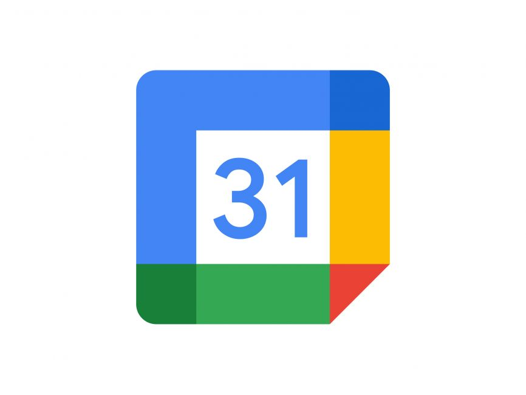

# NeoNest

*Created by TripleA*

Application NeoNest is our answer for this year's EESTech challenge final round in Sarajevo

## General usage

The main goal of NeoNest is to improve quality of life by implementing small improvements that are being recommended by AI.
We wanted to make an app that will combine sensors that gather data (CO2, Atmospheric pressure ...) and well-known Artificial intelligence.
After entering the app, you will see beautifull interface that shows you how good or bad the air in your room is, and have some recomedations on how to possibly improve it more. 

## Requirements

Visual Studio Code, [Simple flutter installation guide](https://docs.flutter.dev/get-started/install), Emulator or phone to test application during production,
[Google Calendar API](https://console.cloud.google.com/apis/dashboard), Python 3+, HomeAssistant API, 

## Server setup

[Server repo](https://github.com/StewKI/NeoNest_server)
## Future improvements

In tehnical way we would have done a improvements on AI quality, addition of more sensors

### For any questions that you have be free to ask
